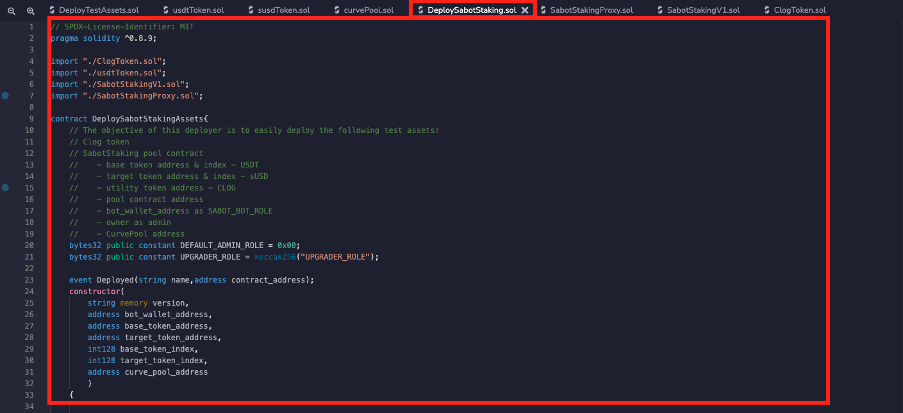
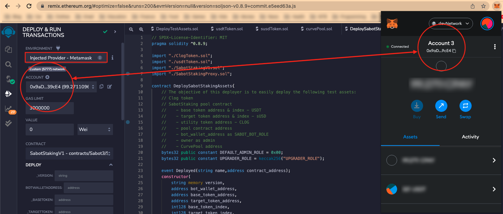
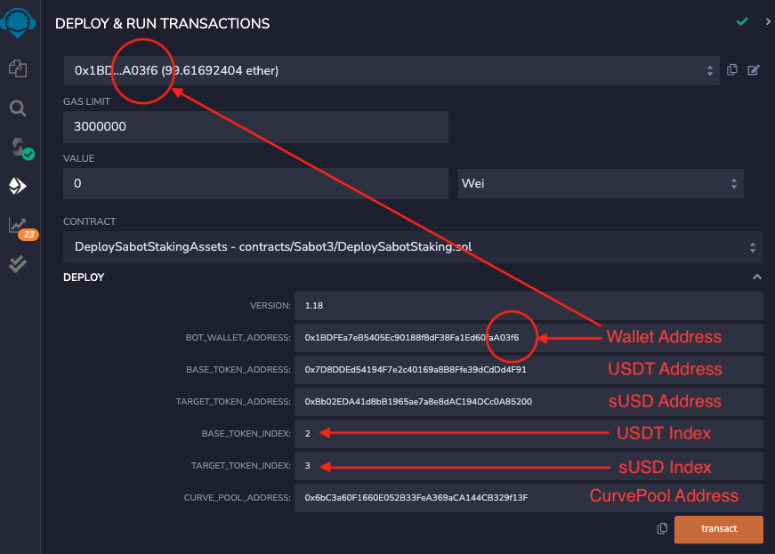
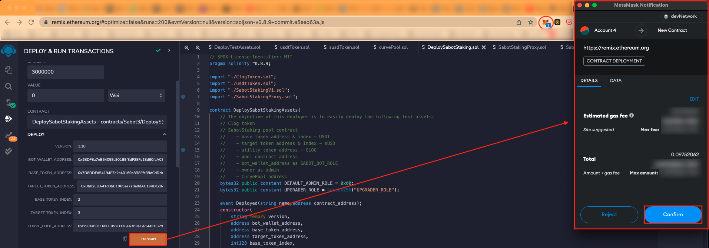
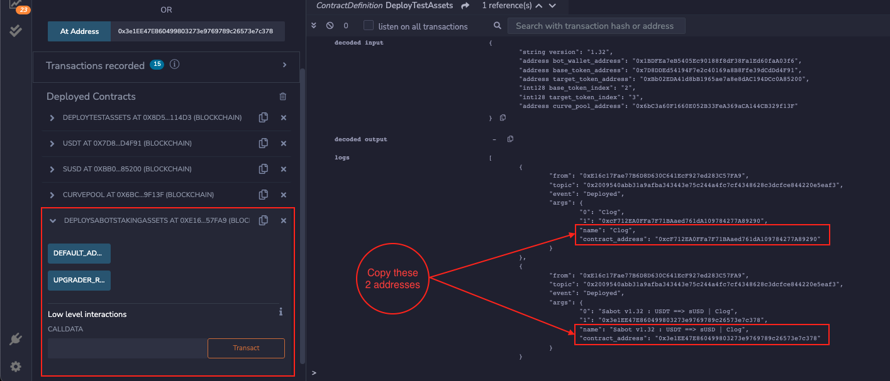
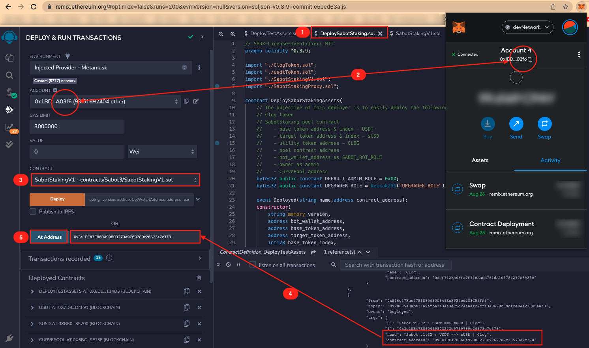

# SabotStaking Pool
The `SabotStaking Pool` is a configurable fit for purpose defi pool aimed at accelerating the implementation of automated cryptocurrency arbitrage trading strategies.

The solution consists of a set of coordinated web3 applications and smart contracts that are designed to:
* Secure participant assets.
* Prevent risk of fraud, rug pulls and other nefarious actions.
* Minimize transaction costs through on-chain trading.
* Scale to support the demands of large defi solutions.

### **Tech**
* wizard.openzeppelin.com - An online wizard provided by OpenZeppelin that creates contract skeleton based on advanced feature selections.

---

## Solution Design
The following scenarios were generated to drive out the critical design aspects and dependencies.

### SCENARIO | Staking

#### **Objective**
Allow participant to stake a certain amount of `USDT` and receive `CLOG` in return.  This is done through our SabotStaking UI.

#### **Prerequisites**
* Participant has wallet.
* Participant has available `USDT` to stake.
* `SabotStaking` smart contract is deployed.
* UI has SabotStaking contract address and ABI.
* SabotStaking smart contract is authorized as the `MINTER_ROLE` for `CLOG`.

#### **Requirements**
* Participant connects their wallet by entering wallet address into the address text field.
* UI connects the wallet.
* Participant enters the amount of `USDT` they want to stake.
* Participant clicks on the stake button to execute the stake.
* UI effects a transfer of `USDT` from the participants wallet to the `SabotStaking` smart contract.
* `SabotStaking` smart contract mints an amount of `CLOG` proportional to the amount of `USDT` that was staked.
* `SabotStaking` smart contract assigns the minted `CLOG` to the wallet that staked the `USDT`.
* `SabotStaking` smart contract emits an event that indicates staking occurred.
* UI confirms swap has occured by looking at the transaction receipt and confirming that the Staking event exists and indicates the amount of `CLOG` received from the staking.

#### **Verification**
* Participant wallet `USDT` balance is decremented by the amount that was staked.
* Participant wallet `CLOG` balance is increased by an amount proportional to what was staked.
* `SabotStaking` smart contract `USDT` balance is increased by the amount that was staked.

---

### SCENARIO | Arbitrage Trading

#### **Objective**
The `bot` is able to send trade orders to the `Staking` Smart contract and the `staking` contract executes trade on chain.

#### **Prerequisites**
* `Bot` has an eth wallet in order to send transactions to the blockchain.
* `Bot wallet` is funded with sufficient eth to be able to execute swap transactions.
* `SabotStaking` smart contract is deployed.
* `Bot` has SabotStaking contract address and ABI.
* `Bot wallet` was authorized as the `SABOT_TRADER` role in the SabotStaking smart contract.
* `Sabot Trading Monitor` is listening to events emitted by SabotStaking.
* `SabotStaking` smart contract is set up with the Curve Pool address.
* `SabotStaking` smart contract is set up with the token address to pool index mapping.

#### **Requirements**
* Sabot `bot` python program makes a call to the swap method of the `SabotStaking` smart contract.
* `Sabot` smart contract translates from token address to pool index.
* `SabotStaking` smart contract calls `Curve Pool exchange` function to execute swap.
* `SabotStaking` emits an event that swap has occurred.
* `Sabot Trading Monitor` shows the swap event.

#### **Verification**
* Swap event is observed in the Sabot Trading Monitor.

---

### SCENARIO | Tokenomics 

#### **Objective** 
Demonstrate that the `CLOG` is effective at:
- Representing participant ownership stake.
- Tracking participant porportional value.
#### **Prerequisites**
* `SabotStaking` smart contract is deployed.
* `SabotStaking` smart contract has a portfolio of `USDT tokens` (stretch goal to also have sUSD, though not MVP).
* `SabotStaking` has participants and there is an amount of `CLOG tokens` in circulation.
* `SabotStaking` has a method to calculate and return token price.
* Two participants with `CLOGs`.
#### **Requirements**
* Get initial `CLOG` price.
* Artificially increase portfolio value by transferring a quantity of `USDT` to `SabotStaking` smart contract.
* Get subsequent `CLOG` price.
#### **Verification**
* Initial `CLOG` price accurately reflects SabotStaking portfolio value / `CLOG tokens` in circulation.
* Each participant share and value is accuretly represented by amount of `CLOG tokens` each have and price of tokens.
* After increase, `CLOG` price accurately reflects SabotStaking portfolio value / `CLOG tokens` in circulation.
* Each participant share is unaffected by increase in price, but increase in value is relfected in `CLOG` increase in price.
 
---

### SCENARIO | Deployment

#### **Objective**
There are dependencies that will need to be configured properly.  To minimize cost, a deployment contract will be used. All on chain configuration will be effected through the deployment contract.  

To minimize cost, on-chain configuration will be prioritized over off chain configuration and only one deployment transaction should be needed.  

The resulting smart contract ensures asset safety and prevents rug pull or any other adverse action by any nefarious actor.

#### **Prerequisites**
* `CLOG token` contract is compiled.
* `SabotStaking` contract is compiled.
* `Bot wallet` address is available.
* `USDT token` address is available.
* `USDT token index` in `Curve Pool` is available.
* `sUSD token` address is available.
* `sUSD token index` in `Curve Pool` is available.
* `Curve Pool` smart contract is deployed and `Curve pool` contract address is available.
* `Multisig wallet` is available  (needs more elaboration).

#### **Requirements**
* Multisig contract deploys the deployment contract.
    * Passes in the following:
        * `bot wallet` address.
        * Mapping of `coin` address to `pool` index.
        * `curve pool` address.

* Deployment contract deploys the SabotStaking contract and gets its address.
    * Set the `bot` address as the SabotStaking `TRADER_ROLE` in constructor.
    * Set the `Curve Pool` address in constructor.
    * Set coin to pool integr mapping in the constructor.

* Deployment contract deploys the `CLOG` token contract and gets its address.
    * Set the `SabotStaking` contract address as the `CLOG MINTER_ROLE` in constructor.

#### **Verification**
* `SabotStaking` contract is deployed.
* `Clog token` contract is deployed.
* `bot wallet` address has the `SABOT_TRADER` role.
* No other addresses have the `SABOT_TRADER` role.
* `SabotStaking` smart contract address has the `CLOG_MINTER` role.
* No other addresses have the `CLOG_MINTER` role.
* The other scenarios can be performed as expected.

---

## SOLUTION ASSETS INVENTORY
The solution consists of several components which are identified below:

| Asset | Technology | Type | Description |
|-------|------|---------|------------ |
| Staking.py | Streamlit | Solution | The UI users can use to stake `USDT` to participate in the Sabot pool. |
| event_filter.py | Python | Solution | A simple CLI that monitors transactions in the SabotStaking contract to give visibility to what is happening in the contract. |
| ClogToken.sol | Solidity | Solution | The smart contract that implements the CLOG ERC-20 utility token. |
| SabotStakingProxy.sol | Solidity | Solution | The ERC1697 proxy smart contract that enables UUPS. |
| SabotStakingV1.sol | Solidity | Solution | The SabotStaking implementation (aka logic) smart contract that the proxy contract delegates to. |
| curvePool.sol | Solidity | Mock | A smart contract that implements a mock for a Curve liquidity pool. |
| usdtToken.sol | Solidity | Mock | A smart contract that implements a mock for the base token for the arbitrage strategy. |
| susdToken.sol | Solidity | Mock | A smart contract that implements a mock for the target token for the arbitrage strategy. |
| DeploySabotStaking.sol | Solidity | Deployment | The smart contract that deploys the on-chain portions of the SabotStaking solution. |
| DeployTestAssets.sol | Solidity | Deployment | The smart contract that deploys the on-chain mock contracts needed for testing. |

---

## DEPLOYMENT AND TESTING
Since this solution consists of `Web3` applications and and smart contracts, `Ganache` is used as the test environment in the following section.

### 1. Allocate Wallet Addresses 

*a table that lists how many of the ganache wallets will be used and for what purpose*

### 2. Deploy Test Assets         
If deploying in a test environment, deploy dependencies using **DeployTestAssets.sol**.

*Instructions needed, additionally, video even better*
*list addresses that need to be retrieved and how to do that*

1. Select the "DeployTestAssets.sol" contract in the Remix IDE

2. Select your wallet #1 in Metamask. 

    * In Remix, in the `DEPLOY` -> `ENVIRONMENT` drop down menu select `Injected Provider - Metamask`.
    * The address should echo exactly the selected wallet from Metamask.

3. In the `CONTRACT` drop down menu, select the `DeployTestAsset` contract.

    * Fill-in the `INITIALAMOUNT` value in the edit box followed by 18 digits.
    * Add the `WALLET_TO_INITIALIZE` between brackets (ie. ["wallet adress 1", "wallet address 2", "wallet address n"]).

4. Your `Metamask` wallet will pop-up and resquest a confirmation. Press `Confirm`.

5. Once confirmed, the `DeployTestAsset` contract will:
    * Add a transaction log in the `log terminal` (bottom part of the UI) where you will retrieve the `USDT`, `sUSD` and `CurvePool` contract address which will be needed for the `DeploySabotStaking` contract.
    * The contract also appears in the `Deployed Contracts` section to the bottom left side of the Remix UI.

6. Verify the deployment of the `USDT`, `sUSD` and `CurvePool` contract (OPTIONAL).

    1. Verification of the USDT contract deployment:
        1. In the `CONTRACT` drop down menu, select the `USDT` contract
        2. Paste the `USDT` address from `DeployTestAsset` logs (see section 5) next to the `At Address` in the `Deploy` section.
        3. Click on the `At Address` button.
        4. The contract will appears in the `Deployed Contracts` section to the bottom left side of the Remix UI.
        5. Open the contract and click on the `name` button.
        6. The name should display `USDT`
    2. Repeat the same steps for the `sUSD` and the `CurvePool` contracts.
  

### 3. Deploy SabotStaking

1. Select the `"DeploySabotStaking.sol"` contract in the Remix IDE.

2. Select your assigned `Bot` wallet in Metamask (select one of the created wallet in the `"1. Allocate Wallet Addresses"` section of the README file and make sure it does not conflict).
    * In `DEPLOY` -> `ACCOUNT` drop down menu, the address should echo exactly the latest selected wallet from Metamask (aka the `Bot` wallet).

3. In the `CONTRACT` drop down menu, select the `DeploySabotStakingAsset` contract. Open the `DEPLOY` menu.

    * Fill-in the `VERSION` value in the edit box (ie. 1.18).
    * Add the `BOT_WALLET_ADDRESS`. Copy/Paste either from the `ACCOUNT` drop down menu or from `Metamask`.
    * Add the `BASE_TOKEN_ADDRESS` by pasting the `USDT` address from `DeployTestAsset` logs (see `Deploy Test Assets` section 5).
    * Add the `TARGET_TOKEN_ADDRESS` by pasting the `sUSD` address from `DeployTestAsset` logs (see `Deploy Test Assets` section 5).
    * Set the `BASE_TOKEN_INDEX` to `2` for `USDT`.
    * Set the `TARGET_TOKEN_INDEX` to `3` for `sUSD`.
    * Add the `CURVE_POOL_ADDRESS` by pasting the `Curve_Pool` address from `DeployTestAsset` logs (see `Deploy Test Assets` section 5).

4. Once all the information has been completed press on `transact`. Your `Metamask` wallet will pop-up and resquest a confirmation. Press `Confirm`.

5. Once confirmed, the `DeploySabotStakingAsset` contract will:
    * Add a transaction log in the `log terminal` (bottom part of the UI) where you will retrieve the `CLOG Token` address and the `SabotStaking` contract address which will be needed for the `SabotStakingV1` contract.
    * The contract also appears in the `Deployed Contracts` section to the bottom left side of the Remix UI.

6. Congratulation! You've successfuly deployed the `DeploySabotStakingAsset` contract.

### 4. Configure REMIX IDE       
*Instructions on how to configure REMIX IDE for Testing*

1. Select the `"SabotStakingV1.sol"` contract in the Remix IDE.
2. Verify that your `Bot` wallet is selected in Metamask and in your Remix `ACCOUNT` drop down menu.
3. In the `CONTRACT` drop down menu, select the `SabotStakingV1` contract.
4. Paste the `SabotStaking` contract address from the `DeploySabotStakingAsset` logs (see `Deploy SabotStaking` section 6) next to the `At Address` in the `Deploy` section.
5. Click on the `At Address` button.

6. The contract will appears in the `Deployed Contracts` section to the bottom left side of the Remix UI.
7. Open the contract and click on the `name` button.
8. The name should display `USDT ==> sUSD | Clog`

### 5. Configure participant wallets
*Instructions on how to connect participant wallets, e.g. adding USDT sUSD and CLOG tokens, video even better*

---

### TEST SCENARIOS

#### Participant Staking     
*Instructions / demo on how a participant stakes USDT in order to join the pool and receives CLOG, video even better**

Step 1: Navigate to SaBot Staking UI

Step 2:Enter your wallet address

Step 3: Select amount of USDT you'd like to stake

Step 4: Check balances in your account 

#### Automated arbitrage trading  
*Instructions on how to set up the monitor and / demo showing automated arbitrage trading, video even better**

---

### Cost Analysis
An exploration of costs was conducted.  At the time of the analysis

* gas fee = 10 gwei
* 1 eth = $1,465.16

| Transaction | Version | Gas | gwei | cost $(USD) |
|-------------|---------|-----|-----|------| 
| Deploy Test Assets |   -  | 4968102 | 49681020 | 126.92 |
| Deploy SabotStaking Assets | non-proxy | 6784487 | 67844870 | 173.33 |
| Deploy SabotStaking Assets | proxy | 9069888 | 90698880 | 231.72 |
| Directly call Curve pool exchange method |  -  | 25457 | 254570 | 0.65037 |
| Bot calling swap method | non-proxy | 51902 | 519020 | 1.3260 |
| Bot calling swap method | proxy | 68661 | 686610 | 1.7541 |
| ERC20 approval for staking |  -  | 46179 | 461790 | 1.1798 |
| Staking | non-proxy | 130105 | 1301050 | 3.3239 |
| Staking | proxy | 132993 | 1329930 | 3.3239 | 3.3977 |

---
